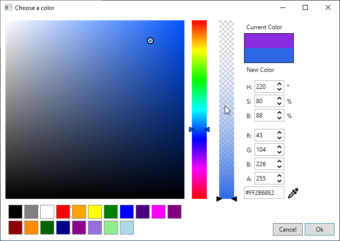

# Wpf color picker

Standalone Wpf color picker



## Requirements
**.Net framework >= 4.6.2**

## Installation
[Install nuget package here](https://www.nuget.org/packages/dsafa.WpfColorPicker)

## Usage
1. Create the instance of the dialog
```cs
var initialColor = Colors.Blue;
var dialog = new ColorPickerDialog(initialColor);
```
2. Show the dialog
```cs
var result = dialog.ShowDialog();
```
3. Check the dialog results and get the color
```cs
if (result.HasValue && result.Value)
{
    var newColor = dialog.Color;
}
```

Dialog constructors
```cs
public ColorPickerDialog()
public ColorPickerDialog(Color color)
public ColorPickerDialog(Color color, IEnumerable<Color> palette)
```
